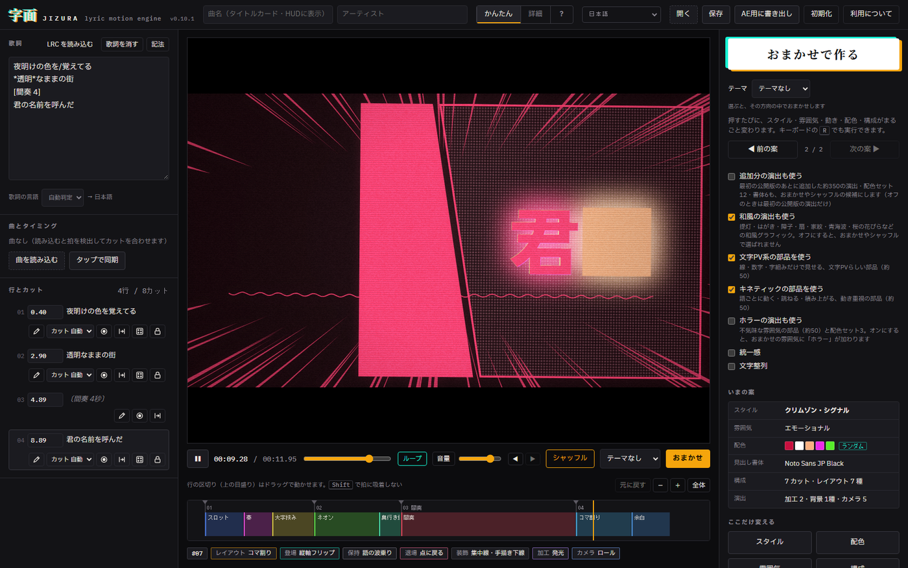

# dsh-tool-jizura

> 给 [DSH](https://github.com/deepseek-ai/deepseek-harness) 用的工具插件：把一段歌词交给
> [JIZURA](https://852wa.github.io/JIZURA/) 在线应用，自动产出**文字 PV**（MP4 视频或連番 PNG）。



上图是插件实际驱动 JIZURA 之后的界面：左侧歌词由 `generate_jizura_pv` 填入，并被解析为
「4 行 / 8 カット」；右侧「おまかせ」已生效（スタイル：クリムゾン・シグナル）；
中间是实时预览。该图由无头 Chromium 跑真实流程截取。

## 功能

注册一个工具 `generate_jizura_pv`。模型只要拿到歌词文本，就能驱动 JIZURA 完成
「填歌词 → 载入背景音乐 → 设定画幅与风格 → 点『おまかせで作る』→ 导出 → 落盘」的整条链路，
最后返回产物文件的**绝对路径**。

- 无头 Chromium 驱动，无需用户手工点页面。
- 支持背景音乐、画幅比例、视觉风格预设、MP4 / PNG 序列两种输出。
- 遵守 DSH 的取消信号：调用被中止时立即关闭浏览器进程。
- 使用方无需额外 API Key，但**需要网络访问**（JIZURA 是纯前端在线应用，歌词不上传服务器）。

## 安装

```bash
dsh plugin --profile web add github:Flooding-Rain/dsh-tool-jizura
```

安装后 `generate_jizura_pv` 会出现在 web profile 的工具列表里。

### 前置依赖

插件本体依赖 Node.js 侧的 Playwright，**首次使用前请确保浏览器已就绪**：

```bash
npx playwright install chromium
```

## 使用示例

模型侧最简调用：

```jsonc
{
  "lyrics": "夜明けの色を/覚えてる\n*透明*なままの街\n[間奏 8]\n君の名前を呼んだ"
}
```

带音乐、竖屏、霓虹风格的调用：

```jsonc
{
  "lyrics": "夜明けの色を/覚えてる\n遠くへ消えた",
  "audioPath": "D:\\music\\song.mp3",
  "stylePreset": "neon",
  "aspectRatio": "9:16",
  "outputFormat": "mp4",
  "outputDir": "D:\\output\\pv"
}
```

一次完整的手工验证（`dsh` 会话里）：

> 用 generate_jizura_pv 把下面这段歌词做成 16:9 的 MP4，霓虹风格，输出到 D:\output\pv
> ```
> 夜明けの色を/覚えてる
> *透明*なままの街
> ```

工具执行成功后返回产物路径，界面卡片会显示 `PV 已生成: <绝对路径>`。

## 参数

| 参数 | 类型 | 必填 | 默认 | 说明 |
| --- | --- | --- | --- | --- |
| `lyrics` | string | ✅ | — | 歌词文本，支持多行。JIZURA 的记法（`/` 切分、`*强调*`、`[間奏 8]`、LRC 时间戳）原样可用。 |
| `audioPath` | string | | — | 背景音乐文件绝对路径（mp3 / wav / m4a / aac / ogg / flac）。省略则生成无声 PV。 |
| `stylePreset` | string | | `auto` | `auto` \| `light` \| `dark` \| `neon` |
| `aspectRatio` | string | | `16:9` | `16:9` \| `9:16` \| `1:1` |
| `outputFormat` | string | | `mp4` | `mp4` \| `png_sequence` |
| `outputDir` | string | | `./jizura-pv-output` | 输出目录绝对路径，不存在会自动创建。 |

### 返回值

返回产物文件的绝对路径字符串（`output.schema` 为 `{ "type": "string" }`）。

| 情况 | 返回 | 界面提示 |
| --- | --- | --- |
| 正常生成 | `D:\output\pv\jizura-xxxx.mp4` | `PV 已生成: <路径>` |
| 歌词为空/纯空白 | `""` | `PV 未生成：歌词为空，请提供至少一行歌词。` |
| 基础设施故障 | 抛异常 | 工具以错误卡片呈现 |

### 关于 `outputFormat`

- `mp4`：点 JIZURA 的「MP4 を書き出す」，得到单个 `.mp4`。
- `png_sequence`：点「連番PNG（ZIP）」。注意 JIZURA 原生只会打包成 **一个 ZIP**，
  因此产物是 `.zip` 而非一堆裸 PNG；需要逐帧图片时自行解压。

### 关于 `stylePreset`

JIZURA 没有名为 light/dark/neon 的预设。它把样式包定义在 `src/04_styles.js`
的 `J.STYLES` / `J.STYLE_ORDER`（基础 12 个，运行时另挂 15 个扩展包），
再在 `#styleGrid` 里渲染成可点击的卡片（卡片的 `data-k` 就是样式 key）。
本插件挑选语义最接近的：

| 预设 | JIZURA 样式包 | 特征 |
| --- | --- | --- |
| `light` | `paper`（ペーパー・インク） | `#ECE9E3` 亮纸底、明朝体 |
| `dark` | `noir`（ノワール・クロマ） | `#060607` 黑底白字、青/琥珀色差 |
| `neon` | `magenta`（ポップ・マゼンタ） | `#FF0A8C` 震撼粉 |
| `auto` | 不干预 | 完全交给「おまかせ」随机 |

## 权限与注意事项

- **网络访问**：需要连到 `https://852wa.github.io/JIZURA/`。
- **浏览器进程**：会拉起一个无头 Chromium，执行期间占用数百 MB 内存。
- **耗时**：JIZURA 在浏览器内用 mp4-muxer 逐帧编码，1080p 以上很容易超过 60 秒，
  因此工具 `timeoutMs` 设为 120000（2 分钟）。
- **隐私**：JIZURA 是纯前端应用，歌词与音频只在本地浏览器内处理，不会上传到任何服务器。
- **产物版权**：JIZURA 明确说明「用本工具做出来的视频/图片，权利归制作者」，
  但**所用的歌词与乐曲权利仍归各自权利人**。

## JIZURA 界面选择器维护说明

JIZURA 的 DOM 由 `src/12_ui.js` 在运行时绘制，页面结构一旦变更，本插件的选择器就会失效。
所有选择器集中在 **`src/impl.ts` 的 `SELECTORS` 常量**里，按「优先精确 id，其次通用特征」排序，
探测时逐个尝试并命中第一个可用项。

### 当前依赖的选择器

| 用途 | 候选选择器（按优先级） | 来源 |
| --- | --- | --- |
| 新手引导浮层 | `#tour` | `<div id="tour" role="dialog" aria-modal="true">` |
| 引导层「スキップ」 | `#tour .tour-skip` → `.tour-skip` | 引导层导航里的跳过按钮 |
| 歌词输入 | `#lyrics` → `textarea` → `[contenteditable="true"]` → `[aria-label*="歌詞"]` → `[aria-label*="歌词"]` | `<textarea id="lyrics">` |
| 音频文件 | `#audioFile` → `input[type="file"][accept*="audio"]` | `<input id="audioFile" type="file">` |
| 切「かんたん」模式 | `#modeEasy` | `<button id="modeEasy">かんたん</button>` |
| かんたん面板 | `#easyPanel` | `<div id="easyPanel" class="easy" hidden>` |
| 「おまかせで作る」 | `#btnOmakaseBig` → `#btnOmakase` → `#btnOmakaseTop` | `<button id="btnOmakaseBig" class="omakase">` |
| 画幅比例 | `#eAspect` → `#outAspect` | `<select id="eAspect">` |
| スタイル标签页 | `button[role="tab"][data-tab="style"]` | `<nav class="tabs">` |
| 样式卡片 | `#styleGrid button[data-k="<styleKey>"]` | `src/12_ui.js` 的 `drawStyleGrid()` |
| MP4 导出 | `#eMP4` → `#btnMP4` | `<button id="eMP4">MP4 を書き出す</button>` |
| PNG 序列导出 | `#ePNG` → `#btnPNG` | `<button id="ePNG">連番PNG（ZIP）</button>` |
| 「書き出し」标签页 | `button[role="tab"][data-tab="out"]` | 詳細模式的兜底路径 |

> 上表已于 2026-10-07 用 Playwright 1.63 + Chrome Headless Shell 153 对真实页面
> <https://852wa.github.io/JIZURA/> 逐项探测确认：**所有首选选择器均命中且可见**。
> 下面第 1 个坑正是这次探测发现的——它推翻了仅凭 `body.html` 得出的结论。

### 三个必须知道的坑

1. **静态模板与实际运行时状态相反。**
   `app/body.html` 里 `#easyPanel` 带 `hidden`、`#modePro` 带 `aria-pressed="true"`，
   看起来默认是「詳細」模式；但实测页面加载完成后 JS 会把默认模式设为**「かんたん」**
   （`#modeEasy[aria-pressed="true"]`、`#easyPanel` 不含 `hidden`、`#btnOmakaseBig` 可见），
   此时 `#outAspect` / `#btnMP4` / `#btnPNG` 与各标签页反而是隐藏的。
   因此 `clickOmakase()` 先直接找可见的 `#btnOmakaseBig`；只有找不到时才点 `#modeEasy`
   切模式并等面板出现，最后才回退到詳細模式的 `#btnOmakase` / `#btnOmakaseTop`。
   **不要照抄 `body.html` 推断初始可见性。**

2. **风格预设必须在「おまかせ」之后应用。**
   `おまかせ` 会重掷 `style`、`mood`、配色与构成（见 `src/08b_omakase.js`）。
   若先选样式再点おまかせ，样式会被随机覆盖。因此 `generateJizuraPv()` 的顺序是
   「填歌词 → 载音频 → 设画幅 → **点おまかせ** → **应用 stylePreset** → 导出」。
   画幅比例（`#eAspect`）属于输出设置，不受おまかせ影响，所以可以先设。

3. **每次调用都会撞上全屏新手引导浮层，它会吞掉所有点击。**
   `#tour` 是 `role="dialog" aria-modal="true"` 的遮罩。每次新建浏览器上下文都算
   「首次访问」，所以**每次调用都会出现**。不处理它，第一次点击就会失败并报
   `... intercepts pointer events`。这个坑单元测试发现不了，是靠真实端到端跑出来的。
   因此 `generateJizuraPv()` 在导航完成后立刻调用 `dismissTour()`：优先点
   `#tour .tour-skip`，点不到则用 `page.addStyleTag()` 把 `#tour` 置为 `display:none` 兜底。

### 页面结构变更后的修法

1. 打开 <https://852wa.github.io/JIZURA/>，用开发者工具确认新元素。
2. 更新 `src/impl.ts` 的 `SELECTORS`（尽量追加候选而非替换，保留兜底）。
3. 若是样式包改名，同步更新 `STYLE_PRESET_TO_KEY`。实测 `#styleGrid` 会渲染 **27** 张卡片：
   `J.STYLE_ORDER` 声明的基础 12 个
   （`noir` `crimson` `caution` `magenta` `paper` `hud` `mint` `specimen` `transit` `blueprint` `rouge` `mono`），
   加上追加分 / 恐怖 / 和风的 15 个
   （`hrRuin` `hrNightRec` `hrCurse` `sakura` `ocean` `sunset` `forest` `vapor` `newsprint` `synth80` `kraft` `candy` `acid` `sumi` `gold`）。
   本插件的三个预设都落在基础 12 个内，因此不受「追加分」开关影响。
4. 跑 `npm test`（测试里的假 DOM 是手写的，不受真实页面影响，仍应全绿）。
5. 用真实页面做一次端到端验证（见下）。

### 端到端自检

```bash
node --input-type=module -e "
import { generateJizuraPv } from './lib/impl.js';
const p = await generateJizuraPv({
  lyrics: '夜明けの色を/覚えてる\n*透明*なままの街',
  stylePreset: 'dark', aspectRatio: '16:9', outputFormat: 'mp4',
  outputDir: './tmp-verify',
});
console.log('OK:', p);
"
```

## 开发

```bash
npm install          # 安装开发依赖
npm run build        # tsc -p tsconfig.json → lib/
npm test             # vitest run tests
```

构建产物布局与 `exports` 严格对应：

```
lib/index.js             ← main / exports["."].default
lib/types/index.d.ts     ← types / exports["."].types
lib/impl.js
lib/types/impl.d.ts
```

测试分两层：

- `tests/register.spec.ts` —— 屏蔽 `@deepseek-ai/dsh-tools`，断言 `name`、`inject`
  与工具定义形状（参数、枚举、`output.schema`、`render`、`timeoutMs`）符合 dsh 契约。
- `tests/impl.spec.ts` —— 屏蔽 `playwright`，用假 DOM 覆盖主链路、新手引导浮层关闭、
  样式应用顺序、导出按钮选择、取消信号清理、空歌词短路、导航失败清理，以及路径辅助函数。

当前 `npm test` 共 **20** 个用例（注册契约 9 + 逻辑 11）全部通过。

### 实测记录

在 Windows + Chrome Headless Shell 153 上跑通了一次完整链路：

```
SUCCESS (94.1s)
  path: <outputDir>/jizura.mp4
  size: 20423484 bytes      # ftyp isom / isomavc1mp41（H.264）
```

即「填歌词 → 点おまかせ → 应用 dark 预设 → 导出 MP4 → 落盘」全程无人工干预，
耗时约 94 秒，印证了 `timeoutMs: 120000` 的取值。

## 实现说明

- 插件只注册 `tools` 服务（`inject = ['tools']`），通过 `ctx.tools.register(defineTool({...}))` 注册。
- `execute` 只返回**一个 canonical 值**（文件路径字符串）；业务非理想结果（歌词为空）
  以空串表达，并在 `output.render` 里提示，不抛异常。
- 基础设施故障（浏览器启动失败、导航超时、找不到关键元素）直接抛出。
- 无论成功或失败，`finally` 都会关闭 context 与 browser；取消信号触发时另有关闭处理器立即介入。

## 致谢与许可

- [JIZURA](https://github.com/852wa/JIZURA) 由 **852wa (hakoniwa)** 开发，MIT 许可。
  本插件只是它的自动化外壳，不含其任何代码。
- 本插件以 **MIT** 许可发布，见 [LICENSE](./LICENSE)。
